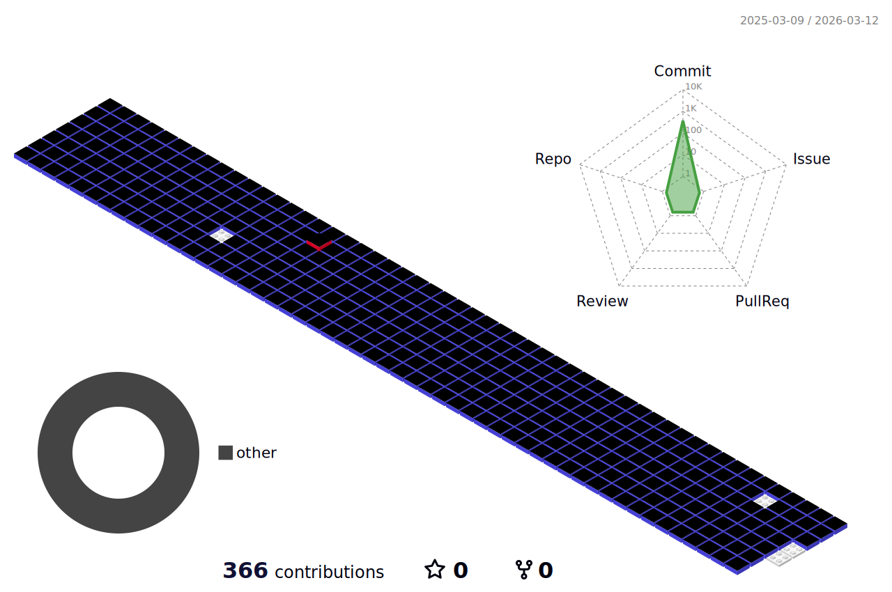

  

  <!---->
  

 
 

<h2 align="left">💻 Tech Stack 💻</h2>

  &nbsp
  </a>&nbsp
  </a>&nbsp 
  
     
  </a>&nbsp
  &nbsp
  &nbsp
  </a>&nbsp
  </a>&nbsp
   
  &nbsp
  </a>&nbsp 
  </a>&nbsp 
  </a>&nbsp 
   
  
  
    
   
  
  
   
   

  

 
 

<h2 align="left">🎀 Contact 🎀</h2>

  

    &nbsp
    
  

 
 

## 📚 DEV's log 📚

    
    

 

<!--
**purbluue/purbluue** is a ✨ _special_ ✨ repository because its `README.md` (this file) appears on your GitHub profile.
-->

