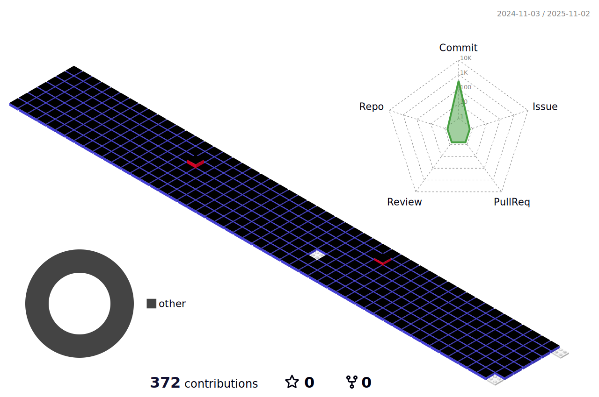

  

  

  

## 📚 DEV's log 📚

    
    
  

 

 
<h3 align="center">🎀 Contact 🎀</h3>

  

    &nbsp
    
  

 

<h3 align="center">💻 Tech Stack 💻</h3>

  &nbsp
  </a>&nbsp
  </a>&nbsp 
  &nbsp
   
  </a>&nbsp
  </a>&nbsp 
  </a>&nbsp
   
  
  </a>&nbsp 
  </a>&nbsp 
  </a>&nbsp 
   
  </a>&nbsp
  </a>&nbsp
  </a>&nbsp
  &nbsp
  &nbsp
   
  
  
  
  </a>&nbsp 

 

  

<!--
**purbluue/purbluue** is a ✨ _special_ ✨ repository because its `README.md` (this file) appears on your GitHub profile.
-->

